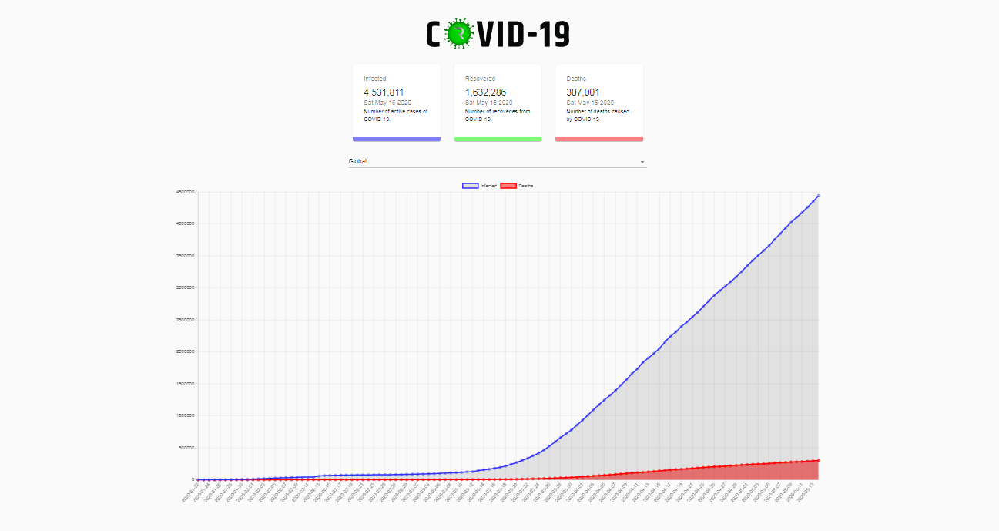
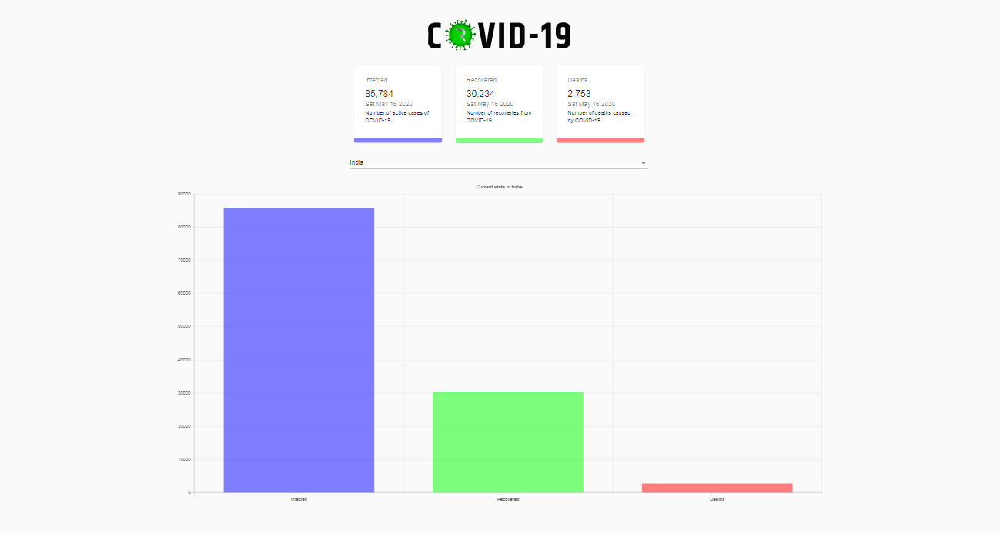

# COVID - 19 TRACKER APP

> This is a COVID - 19 Tracker Application built on react to fetch related data from API and display. The above image shows the landing page with global statistics.

---

> This application features a drop down to select the desired country and display related COVID - 19 data using the same API. The above image depicts the statistics of India as of 15/5/20.

---

### Website

> React Application deployed using Vercel - [View Application](https://csb-2pc5j-mveimhqyx.now.sh/)
 

---

### Table of Contents
You're sections headers will be used to reference location of destination.

- [Description](#description)
- [API Reference](#API-Reference)
- [Author Info](#author-info)

---

## Description

This is a COVID - 19 Tracker app built as a project while experimenting React JS for Front End Development. The Global Pandemic Caused by the SARS Cov 2 Virus has caused a large number of cases and deaths. This React App fetches this data either globally or country wise using a GET Request to an API and displays the data, and charts it.

#### Technologies

- React Js
- Material UI
- Chart Js
- HTML
- CSS

[Back To The Top](#read-me-template)

---

## API Reference

> The following API is used in this project:  https://covid19.mathdro.id/api

---

## Author Info

- Instagram - [@_robotic7o7_](https://instagram.com/_robotic7o7_)
- Website - [Rohan Christopher](https://bit.ly/RohanChristopher)

[Back To The Top](#read-me-template)

---
